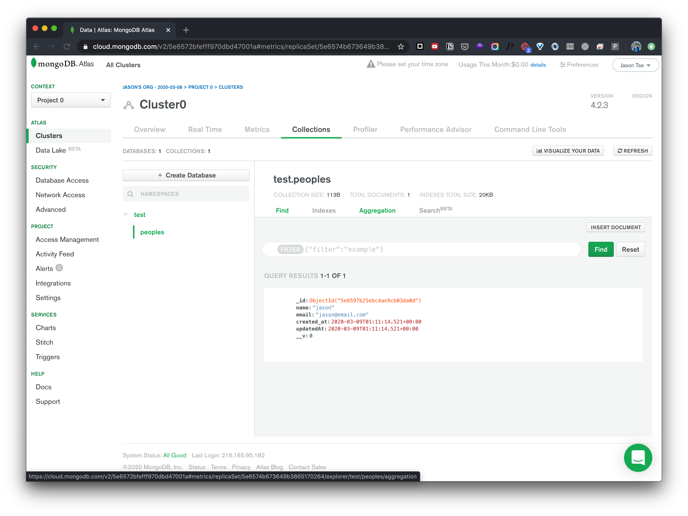

# Sign Up for OptiMice w/ MongoDB

This is the Assignment 5 for the ITP class Dynamic Web Development, at the same time an enhanced fork of the original project [OptimiceSignup](https://github.com/jasontsemf/OptimiceSignup), where the simple `JSON` database is replaced with an actual `MongoDB`.

Check out the live Demo on [Glitch](https://jasontsemf-optimicesignupmongo.glitch.me/)


## Intro
The actual hard work done for this fork is the connection to `MongoDB`. Since storing plain `JSON` and hosting the project on `Glitch` is essentially revealing all the followers' information to the public. I can't wait to incorporate security measures into the project to make it a public-ready one.

## Run it on your own computer

You can either try it on [Glitch](https://jasontsemf-optimicesignupmongo.glitch.me/), or clone the project from [GitHub](https://github.com/jasontsemf/OptimiceSignup). If you are trying to run it on your computer, you have to have `node` installed on your machine before you run the project. Meanwhile, you have to have your own `MongoDB account` setup on `MongoDB Atlas`.

Follow [this guide](https://github.com/itp-dwd/2020-spring/blob/master/guides/installing-nodejs.md) to install `node.js`

And follow [this guide](https://github.com/itp-dwd/2020-spring/blob/master/guides/database-services-guide.md#mongodb-atlas) to setup your `MongoDB Atlas`.

If you're set with cloning and `MongoDB Atlas`. Create the file `.env` at the root of the project by following [this guide](https://github.com/itp-dwd/2020-spring/blob/master/guides/mongodb-guide.md). After installing node, with `terminal`, you can

``` sh
cd the/project/root/path
npm start
```

The terminal will display `Server listening at http://localhost:3000!`. Now open your web browser and navigate to `localhost:3000`. There you have the page and also the server running on your local environment.

## Process of making

### Building the Backend

Following Joey's example, the actual implementation of `MongoDB` is relatively easily. However, most of the code written for the previous assignment is not necessarily to be kept anymore.

``` Javascript
// config variables
const config = require('./config');
const PORT = config.PORT;
const mongoose = require('mongoose');

const MONGODB_URI = config.MONGODB_URI;
mongoose.connect(MONGODB_URI, {
  useNewUrlParser: true,
  useUnifiedTopology: true 
});

const peopleDB = require('./models/people');
```
*Code fot setting up `MongoDB`*

``` Javascript
app.get('/api/total_count', async (req, res, next) => {
  try {
    const data = await peopleDB.find({});
    res.json({ number: data.length});
  } catch (error) {
    res.json({ error: JSON.stringify(error) });
  }
});
```
*New endpoint for users to access the total count of followers*

``` Javascript
app.post('/api/signup', async (req, res, next) => {
  try {
    const data = await peopleDB.find({});
    const newPost = {
      name: String(req.body.name),
      email: String(req.body.email),
      ordinal: String(data.length+1)
    };
    const newData = await peopleDB.create(newPost);
    res.json(newData);
  } catch (error) {
    res.json({
      error: JSON.stringify(error)
    });
    console.log(error);
  }
});
```
*Get the total number of records, then insert the user input data with a ordinal number (total number + 1) into `MongoDB`*


*My first entry created on `MongoDB`*

``` Javascript
const peopleSchema = new Schema({
    "name": String,
    "email": String,
    "ordinal" : Number
}, {
    timestamps: {
        createdAt: 'created_at'
    }
});
```
*Optionally, I added the timestamps JSON option in the constructor to enable created time*


