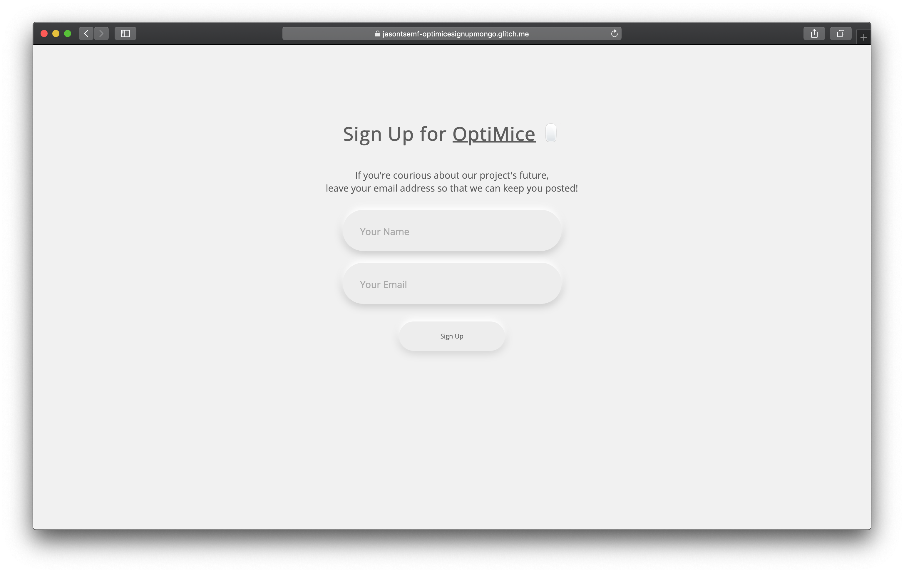

# Sign Up for OptiMice

This ia the Assignment 4 for the ITP class Dynamic Web Development.

Check out the live Demo on [Glitch](https://jasontsemf-optimicesignup.glitch.me/)


## Intro
OptiMice is a project I exhibited at the ITP Winter Show 2020. I displayed the physical project and also the [documentation page](https://jasontsemf.github.io/optimice.html) during the show. People ended up asking if they can sign up online for my project if I sell/monetize in the future. Back then, I didn't code anything but to leave pen and paper for people to leave their name and email. So this web page is what I should have done for my project at that time.

## Run it on your own computer

You can either try it on [Glitch](https://jasontsemf-optimicesignup.glitch.me/), or clone the project from [GitHub](https://github.com/jasontsemf/OptimiceSignup). If you are trying to run it on your own computer, you have to have `node` installed on you machine before you run the project.

Follow [this guide](https://github.com/itp-dwd/2020-spring/blob/master/guides/installing-nodejs.md) to install `node.js`

Once you have node installed, with `terminal`, you can

``` sh
cd the/project/root/path
npm start
```

The terminal will display `Server listening at http://localhost:3000!`. Now open your web browser and navigate to `localhost:3000`. There you have the page and also the server running on your local environment.

## Process of making

### Building the Frontend

The view/HTML I built is essentially a blend of several assignments I've coded for this class, including [Neumorphism](https://github.com/jasontsemf/Neumorphism), [SwissPoster](https://github.com/jasontsemf/SwissPoster) and [Populate](https://github.com/jasontsemf/Populate). The `input` field and `button` has the same style I developed in the Neumorphism project, the layout the I developed in the SwissPoster project using `flex` and the functionality of submitting information.

Essentially, the `frontend javascript` will gather the `name` and `email`, stitch them into a `JSON` and put it into the body of a `request`.

``` Javascript
let name = document.getElementById("name");
let email = document.getElementById("email");
const response = await fetch('/signup', {
    method: "POST",
    body: JSON.stringify({
        "name": name.value,
        "email": email.value
    }),
    headers: {
        "Content-Type": "application/json"
    }
});
```

Once the response hit the client side, the code return a message and provide the user the ordinal number of the signup according to the length of the response return. Techically I should not return the entire `JSON` to the user because of security reasons. But for this project, I include the entire `JSON` in the response just to demonstrate that it can be done.

``` Javascript
const people = await response.json();
const list = document.getElementById("people-list");
const msg = document.getElementById("message");
const link = `Return to <a href="https://jasontsemf.github.io/optimice.html">OptiMice Page</a>`;
msg.innerHTML = `Thank you for signing up, our ${numberToOrdinal(people.people.length)} follower! <br>${link}`;                
console.log(unixConvertor(people.people.created));
name.value = "";
email.value = "";
```

### Building the Backend

I have prior server side programming experience, including `JSP` and also `Salesforce`, but I'm completely new to `node.js`. So it is familiar and strange to me at the same time. Anyhow I think `node.js` is power as you can really finish more with just one language. Especially I can feel the harmony and unity of coding javascript in both frontend and the backened. So far setting up is much less cumbersome compared to ancient `JSP`.

I coded several functions which handle logic and manipulationg to the data, order to seperate the controlling logic from the actual endpoint handing code, by following [this guide](https://github.com/itp-dwd/2020-spring/blob/master/guides/backend-foundations-guide.md).

What the backend would do is simply write the `name` and `email` to a `JSON` file called `people.json`. Also, I added `unixTimeCreated` to each entry intentionally to keep track of when did the user sign up.

``` Javascript
function addPerson(person){
    const unixTimeCreated = new Date().getTime();
    const people = getPeople();
    const timePerson = Object.assign({"created": unixTimeCreated}, person);
    people.people.push(timePerson);
    fs.writeFileSync(path.join(__dirname, "./db/people.json"), JSON.stringify(people));
    return people;
}
```

The reponse is then send back to the client.

``` Javascript
app.post("/signup", (req, res) => {
    const person = req.body;
    const people = addPerson(person);
    res.json(people);
})
```

## Possible Improvement

Of coz including the entire list of people who signed up in the `response`is a bad idea. If I have to preserve this feature of getting the entire list of people securely for specific users (possibly for internal use), I should tap into the security side of `API` building, possibly study how `API` or `oAuth` works and include them into the project.
